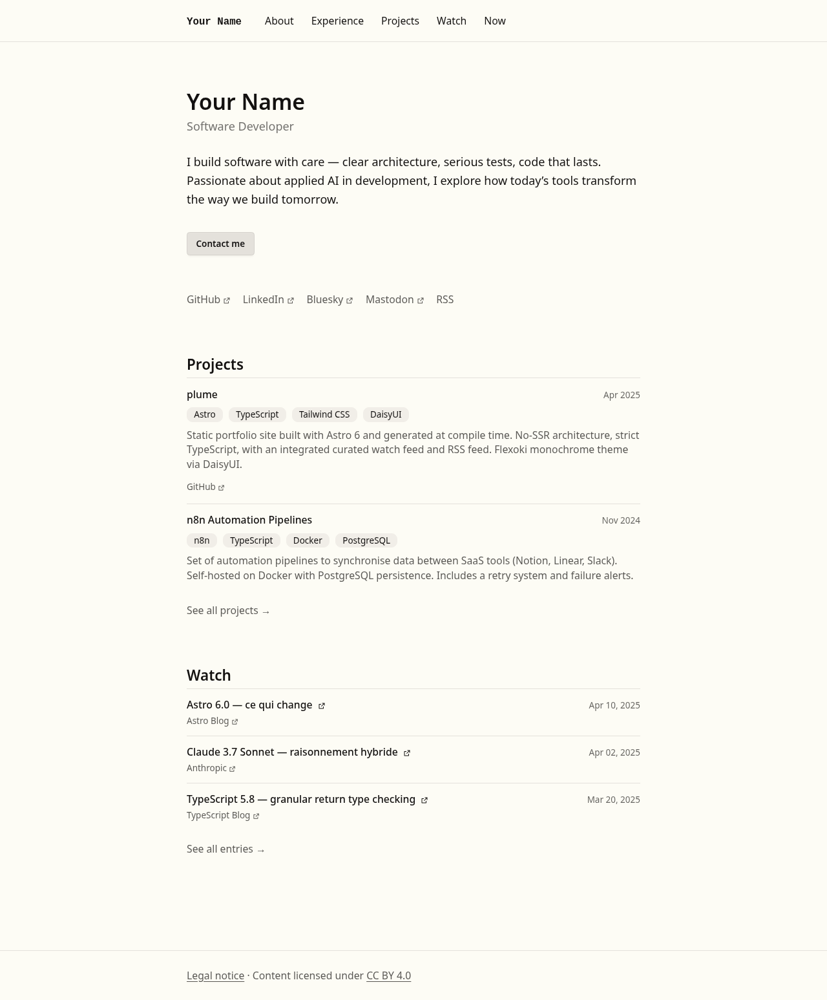
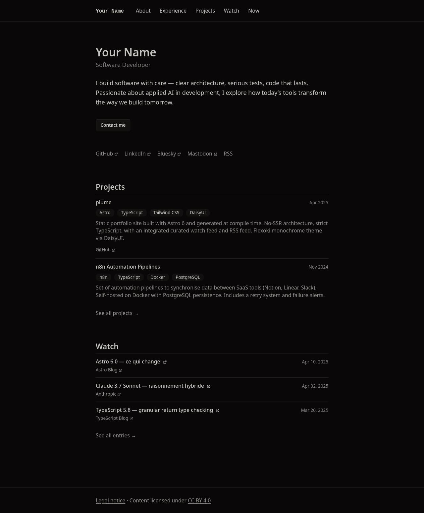
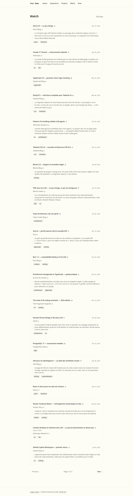
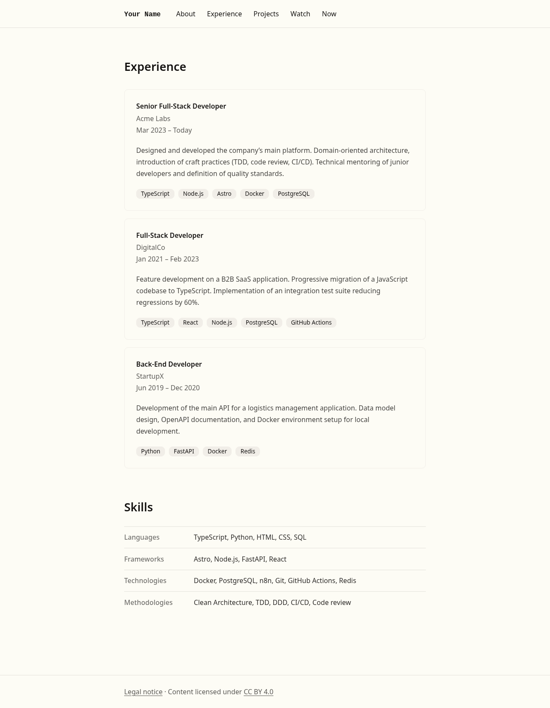
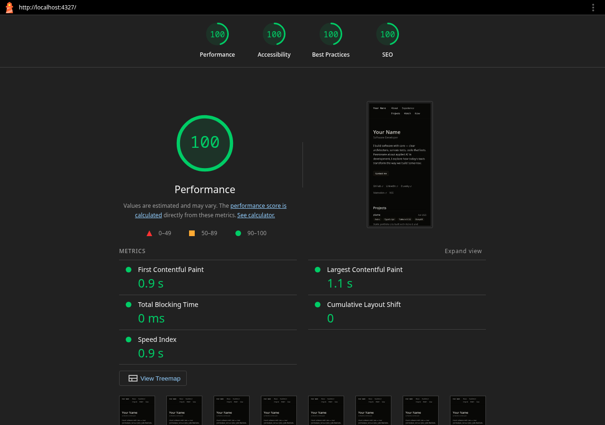

# Plume

A minimal personal portfolio and watch feed theme built with Astro, DaisyUI, and Tailwind CSS.



---

## Overview

Plume is a static site theme for developers who want to share their work, curated links, and professional background — with no JavaScript runtime, no CMS, and no decorative noise. It was built following a **Spec Driven Development** methodology: every decision is written as a plain Markdown spec before any code is written (see [Built from specs](#built-from-specs)).

**Stack:** Astro v6 · DaisyUI v5 · Tailwind CSS v4 · TypeScript strict · Biome · Playwright

**Pages included:**

| Route | Description |
|---|---|
| `/` | Hero, social links, project preview, watch preview |
| `/about` | Short bio (plain Markdown) |
| `/experiences` | Experience timeline + skills table |
| `/projects` | Project cards with stack and links |
| `/watch` | Paginated link feed with RSS at `/watch/rss.xml` |
| `/now` | Current focus (plain Markdown) |
| `/legal` | Legal notice (plain Markdown) |

---

## Screenshots

The theme adapts automatically to the OS colour preference — no JavaScript required.

| Light (default) | Dark (`prefers-color-scheme: dark`) |
|---|---|
|  |  |

| Watch | Experiences |
|---|---|
|  |  |

### Lighthouse — Home



### Build output sizes

HTML pages are minified at build time via `astro-compress` (Logger level 2). Run `npm run build:sizes` to get the per-file breakdown.

| Page | Before | After | Saving |
|---|---|---|---|
| `/` | 9 191 B | 8 848 B | -4% |
| `/about` | 3 530 B | 3 383 B | -4% |
| `/experiences` | 6 821 B | 6 574 B | -4% |
| `/projects` | 7 031 B | 6 760 B | -4% |
| `/watch` | 24 635 B | 23 729 B | -4% |
| `/watch/2` | 5 165 B | 4 937 B | -4% |
| `/legal` | 3 442 B | 3 286 B | -5% |
| `/now` | 3 819 B | 3 661 B | -4% |
| CSS bundle | 96 125 B | 95 916 B | -0% |
| `favicon.svg` | 749 B | 644 B | -14% |

---

## Getting started

Node >= 22.12.0 is required.

```sh
git clone <this-repo> my-site
cd my-site
npm install
npm run dev        # dev server at localhost:4321
```

---

## Commands

| Command | Action |
|---|---|
| `npm run dev` | Start dev server at `localhost:4321` |
| `npm run build` | Build to `./dist/` |
| `npm run preview` | Preview production build locally |
| `npm run check` | Biome lint + format (used in CI) |
| `npm run lint` | Biome lint only |
| `npm run format` | Biome format only |
| `npm run astro ...` | Run Astro CLI (e.g. `astro check`, `astro add`) |
| `npx playwright test` | Run e2e tests (requires a prior `npm run build`) |
| `npm run lighthouse` | Build, start preview, and open [Unlighthouse](https://unlighthouse.dev) UI |

---

## Features and how to modify them

### Identity and hero

Edit `src/data/hero.md`. The frontmatter fields are `name`, `title`, and `email`. The Markdown body is the short pitch displayed under the title.

```md
---
name: "Jane Smith"
title: "Software Developer"
email: "jane@example.com"
---

Two or three sentences about how you work and what you care about.
```

### Site metadata

Edit `src/data/site.json`:

```json
{
  "siteUrl": "https://yoursite.com",
  "siteName": "Jane Smith",
  "defaultTitle": "Jane Smith — Developer",
  "defaultDescription": "...",
  "defaultOgImage": "/og-default.png",
  "veillePreviewCount": 3,
  "veillePageSize": 20,
  "projectsPreviewCount": 2,
  "projectsPageSize": 6
}
```

`siteUrl` must be set for the sitemap and RSS feed to work correctly.

### Social links

Edit `src/data/home.json`. Links with `https://…` open in a new tab; links starting with `/` stay in the same tab (useful for RSS).

```json
{
  "social": [
    { "label": "GitHub", "href": "https://github.com/yourhandle" },
    { "label": "RSS", "href": "/watch/rss.xml" }
  ]
}
```

### UI strings and labels

All static strings (navigation labels, section titles, button text) live in `src/i18n/en.ts`. Edit that file to change any label without touching components or pages.

```ts
export const en = {
  nav: { about: 'About', experiences: 'Experience', ... },
  watch: { title: 'Watch', rssLink: 'RSS feed', ... },
  ...
}
```

To add a second language, create `src/i18n/fr.ts` with the same shape and change the re-export in `src/i18n/index.ts`.

### Experiences

Add `.mdx` files to `src/content/experiences/`. Each file represents one position.

```mdx
---
role: "Software Developer"
company: "Acme Corp"
startDate: "2022-01"
endDate: "2024-06"    # omit for current position
tags: ["TypeScript", "PostgreSQL", "Docker"]
---

Description of what you did and what you built.
```

### Skills table

Edit `src/data/skills.json`. Each entry is a category with a flat list of skill names.

```json
[
  { "category": "Languages", "skills": ["TypeScript", "Python"] },
  { "category": "Frameworks", "skills": ["Astro", "Node.js"] }
]
```

### Projects

Add `.mdx` files to `src/content/projects/`. The `date` field (`YYYY-MM`) controls sort order.

```mdx
---
title: "My Project"
date: "2024-03"
stack: ["Astro", "TypeScript"]
links:
  - { label: "GitHub", url: "https://github.com/..." }
  - { label: "Demo", url: "https://..." }
---

What it is and why you built it.
```

### Watch feed

Add `.mdx` files to `src/content/watch/`. The body is optional — it is rendered as a comment below the link on the full feed page.

```mdx
---
title: "Article title"
url: "https://example.com/article"
date: 2024-11-15
tags: ["typescript"]
source:
  name: "Source Name"
  url: "https://example.com"
---

Optional commentary on why this link is worth reading.
```

### Plain Markdown pages

`/about`, `/now`, and `/legal` are plain Markdown files in `src/pages/`. Edit them directly — no frontmatter schema, just a `title` field used for the `<title>` tag.

```md
---
title: "About"
---

Write whatever you want here.
```

---

## Adapting the colour scheme

The theme uses [Flexoki](https://stephango.com/flexoki) in monochromatic mode. Two variants are defined in `src/styles/global.css` — `flexoki-light` (default) and `flexoki-dark` — and the active one is selected automatically via `prefers-color-scheme`. No JavaScript is involved.

Every token follows the [DaisyUI semantic naming convention](https://daisyui.com/docs/themes/). To swap to a different palette, replace the `oklch(…)` values in the relevant block:

```css
/* Light variant — shown by default */
@plugin "daisyui/theme" {
  name: "flexoki-light";
  default: true;
  color-scheme: light;

  --color-base-100: oklch(99% 0.009 96);       /* page background */
  --color-base-200: oklch(95% 0.009 82);       /* card background */
  --color-base-300: oklch(91% 0.008 78);       /* borders */
  --color-base-content: oklch(18% 0.005 52);   /* body text */

  --color-primary: oklch(27% 0.006 53);        /* primary interactive */
  --color-accent: oklch(49% 0.16 22);          /* accent (used sparingly) */
  /* … */
}

/* Dark variant — applied when prefers-color-scheme: dark */
@plugin "daisyui/theme" {
  name: "flexoki-dark";
  prefersdark: true;
  color-scheme: dark;

  --color-base-100: oklch(13.35% 0.004 50);    /* page background */
  --color-base-200: oklch(17.8% 0.005 52);     /* card background */
  --color-base-300: oklch(22.5% 0.005 52);     /* borders */
  --color-base-content: oklch(82.5% 0.007 63); /* body text */

  --color-primary: oklch(54% 0.006 56);        /* primary interactive */
  --color-accent: oklch(49% 0.16 22);          /* accent (used sparingly) */
  /* … */
}
```

The `default: true` theme is applied to `:root` unconditionally. The `prefersdark: true` theme overrides it inside `@media (prefers-color-scheme: dark)`. No `data-theme` attribute is set on `<html>` — the switch is entirely CSS-driven.

You can pick `oklch` values directly from [oklch.com](https://oklch.com). To force a single theme regardless of OS preference, remove the `prefersdark` block and keep only the `default` one.

To use a built-in DaisyUI theme instead, replace both `@plugin "daisyui/theme" { … }` blocks with:

```css
@plugin "daisyui" {
  themes: light --default, dark --prefersdark;
}
```

---

## Project structure

```
src/
├── components/          # Presentational .astro components — props in, markup out
│   └── types/           # TypeScript interfaces for component props
├── content/             # Astro content collections
│   ├── experiences/     # .mdx files — one per job
│   ├── projects/        # .mdx files — one per project
│   └── watch/           # .mdx files — one per watch entry
├── data/                # Static data files
│   ├── hero.md          # Name, title, email, bio
│   ├── home.json        # Social links
│   ├── site.json        # Global config (URL, SEO, pagination counts)
│   └── skills.json      # Skills table data
├── i18n/                # UI labels
│   ├── en.ts            # English strings
│   └── index.ts         # Re-exports active language — the only file to change for i18n
├── layouts/             # BaseLayout (SEO, nav, footer) and MarkdownLayout
├── pages/               # File-based routing — data fetching lives here
├── styles/              # global.css — Tailwind + DaisyUI theme tokens only
└── config.ts            # Re-exports from site.json

public/                  # Static assets (favicon, OG image, robots.txt)
tests/                   # Playwright tests
spec/                    # Project specifications (see below)
```

---

## Tests

Tests run against the **production build** via `astro preview`. The Playwright config starts the preview server automatically.

```sh
npm run build
npx playwright test
```

Four test suites:

| File | What it checks |
|---|---|
| `tests/links.spec.ts` | All internal links return HTTP 200 |
| `tests/structure.spec.ts` | Each page has exactly one `<header>`, `<main>`, and `<footer>` |
| `tests/rss.spec.ts` | `/watch/rss.xml` is valid XML with non-empty items |
| `tests/a11y.spec.ts` | WCAG 2.1 AA via axe-core on every sitemap URL |

To regenerate the screenshots in this README after making visual changes:

```sh
npm run build
node --input-type=module << 'EOF'
import { chromium } from 'playwright';
const browser = await chromium.launch();
const page = await browser.newPage();
await page.setViewportSize({ width: 1280, height: 900 });
for (const [url, name] of [['/', 'home'], ['/watch', 'watch'], ['/experiences', 'experiences'], ['/projects', 'projects']]) {
  await page.goto('http://localhost:4322' + url);
  await page.screenshot({ path: `docs/${name}.png`, fullPage: true });
}
await browser.close();
EOF
```

---

## Built from specs

Plume was built following a **Spec Driven Development** approach — without any dedicated tooling. Every design and technical decision is written down as a plain Markdown spec before any code is written. The specs act as the single source of truth: they define structure, content models, styling constraints, and test strategy. An LLM (Claude Code) is then used to implement from the spec, keeping the code and its intent in sync.

All specifications live in `spec/`. Every decision — structure, styling rules, content schemas, testing strategy — is documented there.

```
spec/
├── pages/
│   ├── constitution.md  # Non-negotiable principles — start here
│   ├── home.md          # Home page structure and content model
│   ├── watch.md         # Watch feed — pagination, RSS, rendering rules
│   ├── experience.md    # Experiences and skills
│   └── projects.md      # Projects — cards, preview, pagination
├── tooling.md           # Biome, TypeScript, EditorConfig rules
├── seo.md               # Meta tags, Open Graph, sitemap, robots
├── accessibility.md     # WCAG 2.1 AA constraints
├── testing.md           # Playwright test strategy
└── cicd.md              # GitHub Actions, Dependabot, Coolify deployment
```

### Building your own theme from specs

If you want to adapt this theme significantly or build a new one with the same methodology:

1. **Start with `spec/pages/constitution.md`** — it defines the non-negotiable principles (minimal JS, DaisyUI tokens, no decorative complexity). Keep or rewrite it to establish your own constraints before writing any code.

2. **Rewrite the page specs** (`spec/pages/*.md`) — each file defines the content model, rendering rules, and structure of one route. This is where you decide what data each page exposes and how it maps to components.

3. **Feed the specs to an LLM** — the spec files are designed to be self-contained prompts. Point Claude Code (or another model) at a spec and ask it to implement the described page. The constitution provides the global constraints; the page spec provides the local ones.

4. **Use the testing spec as a contract** — `spec/testing.md` defines what Playwright tests must exist. Writing tests against the spec, not the implementation, gives you regression coverage that survives refactors.

The spec-first approach means you can regenerate, extend, or replace any part of the site by editing the spec and re-running the implementation — rather than reverse-engineering what the code was trying to do.